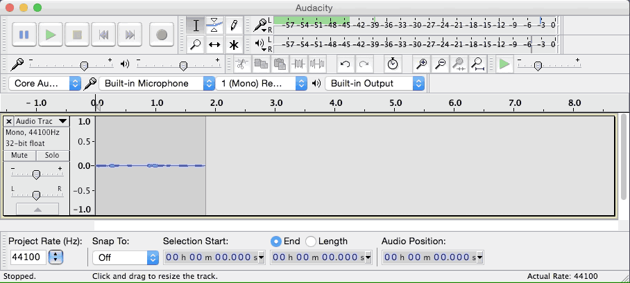

## Contacts
If you have questions or need help getting setup, please don't hesitate to contact us:
- Matt Creager: Skype | creager@heroku.com
- Peter Cho: Skype | pc@heroku.com
-
## Dependencies
- [The internet](https://45.media.tumblr.com/cd67ee315543aad3b9947b67ee49102f/tumblr_mq3o8iycut1qbhoheo1_500.gif) (preferably, fast & dependable)
- [Audacity](http://audacityteam.org/)
- USB headset and/or a microphone + Headphones (avoid ear-buds)
- Peace & quiet.

## Configuring Audacity
Audacity is really simple to use, here are a few tips that will improve the quality of the recording:
- 'Click to Start Monitoring', speak at a normal level and make sure your levels are green

