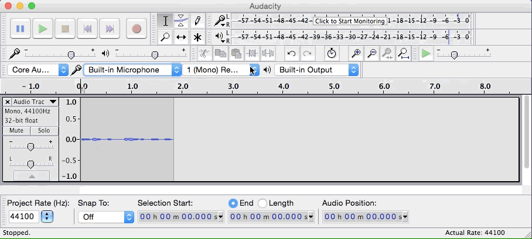
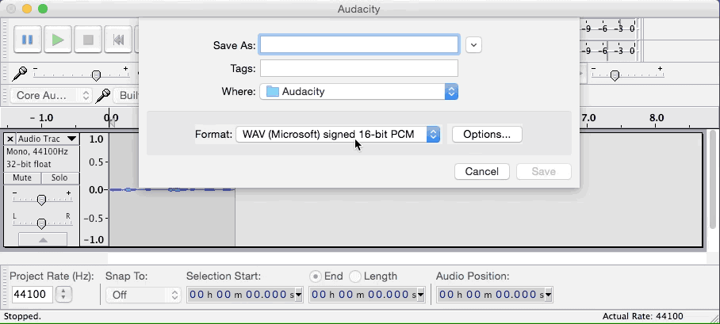

### Contacts

If you have questions or need help getting setup, please don't hesitate to contact us:

- Matt Creager: creager@heroku.com
- Peter Cho: pc@heroku.com

### Dependencies

- [The internet](https://45.media.tumblr.com/cd67ee315543aad3b9947b67ee49102f/tumblr_mq3o8iycut1qbhoheo1_500.gif) (preferably fast & dependable)
- [Audacity](http://audacityteam.org/)
- USB headset and/or a microphone + headphones (ear-buds are evil)
- A quiet corner
- Opinions

### Before we record

- Download & configure Audacity (see the instructions below)
- Find a quiet place to record
- Record a 30 second sample, and send it to Creager & Peter
- Upload the recording to dropbox or something, and send us a link

### Configuring Audacity
Audacity is really simple to use, here are a few tips that will improve the quality of the recording:

#### 1. Choose the appropriate recording device and **record in (Mono)**

#### 2. 'Click to Start Monitoring', speak at a normal level - green is good

#### 3. Export `.aiff`

